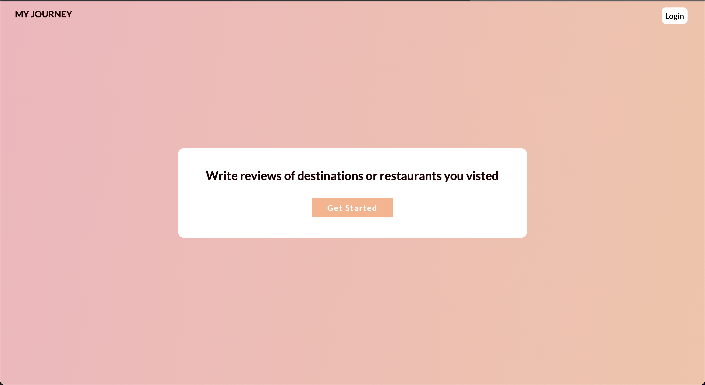
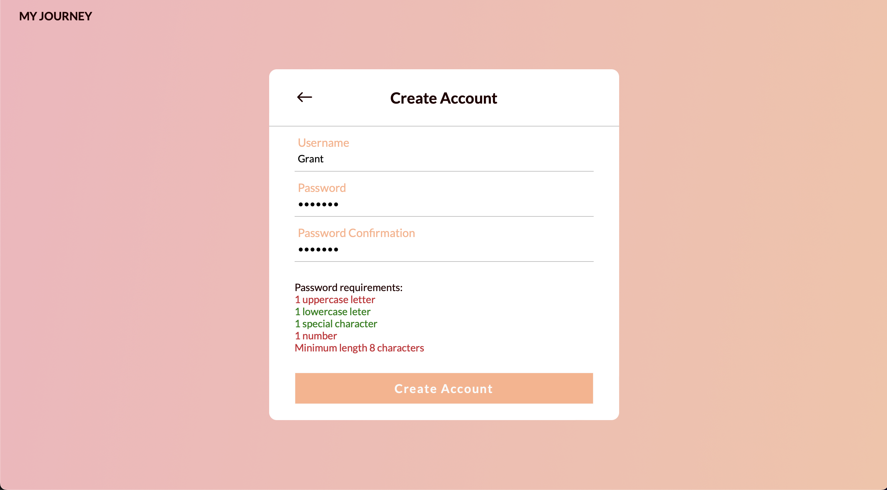
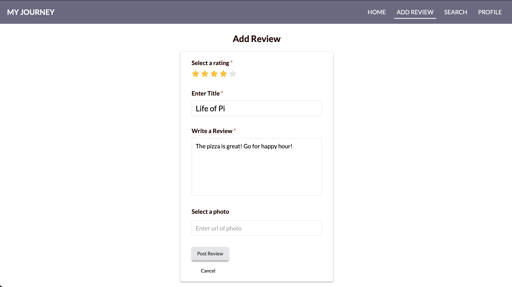
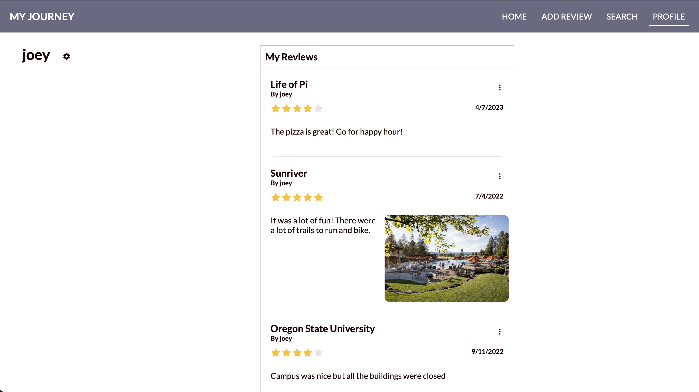

<h3 align="center"> 
NOTE: Not all the code
has been pushed to the repository 
so it won't fully work when you clone it.
</h3>

<h4 align="center">  Welcome to My Journey. 
</h4>

<h4 align="center">This is a review website for users to write reviews of destinations or restuarants they have been at
</h4>

<h3 align="center"> This project will be deployed soon </h3>

<h3 align="center"> Preview </h3>

